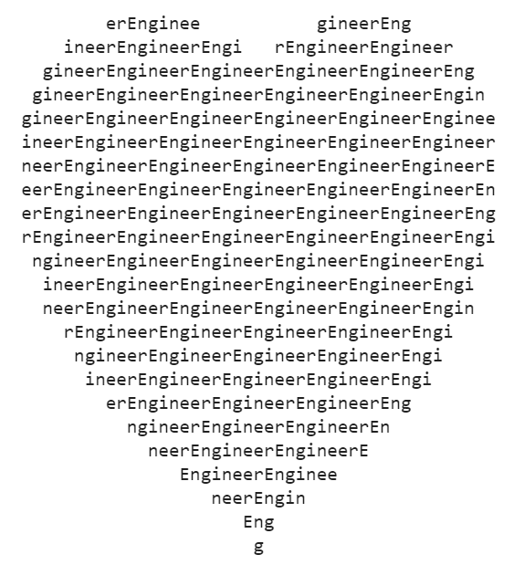

# plot-heart-go
Plot heart with Golang.

The heart-plotting equations were from a Twitter post written in Python, but here is to test implementation in Go.

The **Go** binary was tested running OK in Codelab Jupyter notebook, and it is lighter than the **Rust** version, for which Rust binary can't run in Codelab due to an error of ``/lib/x86_64-linux-gnu/libc.so.6: version `GLIBC_2.28' not found``.

## Result
The heart was plotted as:

